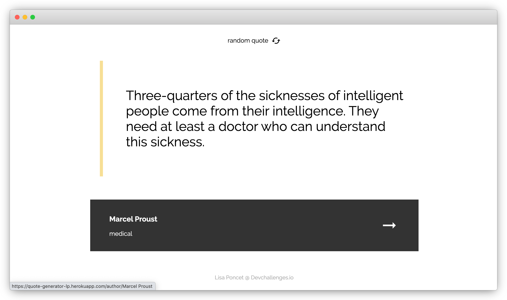

<!-- Please update value in the {}  -->

<h1 align="center">Quote Generator</h1>

<div align="center">
   Solution for a challenge from  <a href="http://devchallenges.io" target="_blank">Devchallenges.io</a>.
</div>

<div align="center">
  <h3>
    <a href="https://quote-generator-lp.herokuapp.com/">
      Demo
    </a>
    <span> | </span>
    <a href="https://github.com/lisapnct/quote-generator">
      Solution
    </a>
    <span> | </span>
    <a href="https://devchallenges.io/challenges/8Y3J4ucAMQpSnYTwwWW8">
      Challenge
    </a>
  </h3>
</div>

<!-- TABLE OF CONTENTS -->

## Table of Contents

- [Overview](#overview)
  - [Built With](#built-with)
- [Features](#features)
- [How to use](#how-to-use)
- [Contact](#contact)

<!-- OVERVIEW -->

## Overview



I built this simple quote generator to practice using React and displaying data from an API. Try it here: 


### Built With

<!-- This section should list any major frameworks that you built your project using. Here are a few examples.-->

- [React](https://reactjs.org/)
- [Axios](https://https://github.com/axios/axios.org/)
- [QuoteGarden API](https://pprathameshmore.github.io/QuoteGarden/)


## Features

<!-- List the features of your application or follow the template. Don't share the figma file here :) -->

This application was created as a submission to a [DevChallenges](https://devchallenges.io/challenges) challenge. The [challenge](https://devchallenges.io/challenges/8Y3J4ucAMQpSnYTwwWW8) was to build an application to complete the following user stories:
- I can see a random quote
- I generate a new random quote
- When I select quote author, I can see a list of quotes from them
- I can see quote genre under the author


## How To Use

<!-- Example: -->

To clone and run this application, you'll need [Git](https://git-scm.com) and [Node.js](https://nodejs.org/en/download/) (which comes with [npm](http://npmjs.com)) installed on your computer. From your command line:

```bash
# Clone this repository
$ git clone https://github.com/lisapnct/quote-generator.git

# Install dependencies
$ npm install

# Run the app
$ npm start
```

## Contact

- Website [lisaponcet.com](http://www.lisaponcet.com)
- GitHub [@lisapnct](https://github.com/lisapnct)
- Linkedin [@lisaponcet](https://www.linkedin.com/in/lisaponcet/)
